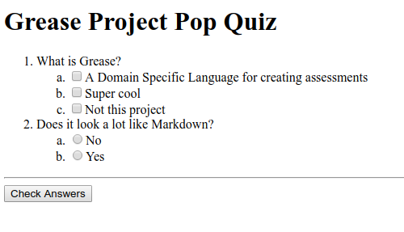

# Grease Project

## Grease

Grease is a syntax for creating assessments that is heavily based on Markdown.

### What does it look like?

```md
# Grease Project Pop Quiz

1. What is Grease?
    * [x] A Domain Specific Language for creating assessments
    * [x] Super cool
    * [ ] Not this project

1. Does it look a lot like Markdown?
    * ( ) No
    * (x) Yes
```

## Swivel

Swivel is a command line application for parsing Grease files into JSON or HTML.



### Usage

_todo_

## Development

1. Run `scripts/setup.sh`.
1. Write code.

_todo_